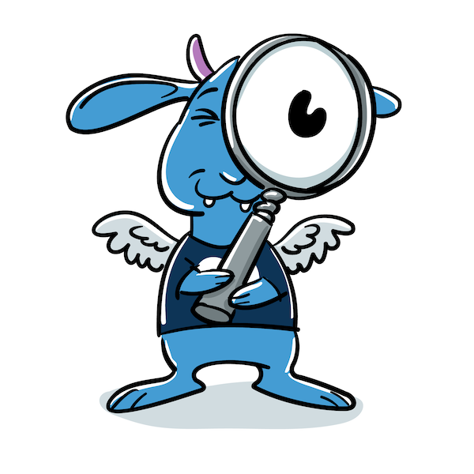

  

# Sesamy Go SDK

> **Se**rver **S**ide T**a**g **M**anagement **S**ystem

## References

- [Event naming rules](https://support.google.com/analytics/answer/13316687)

## How to Contribute

Make a pull request...

## License

Distributed under MIT License, please see license file within the code for more details.

_Made with ♥ [foomo](https://www.foomo.org) by [bestbytes](https://www.bestbytes.com)_
